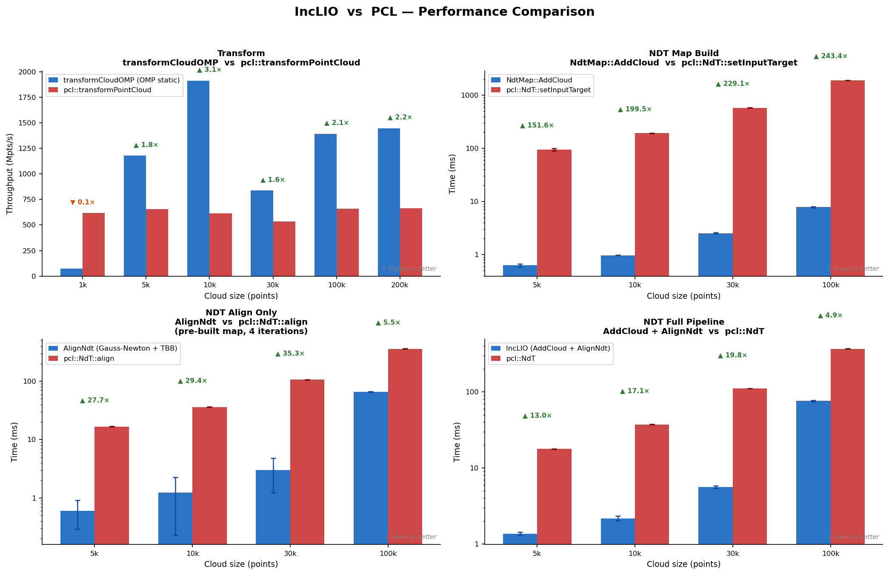

# IncLIO — Incremental LiDAR-Inertial Odometry

A real-time LiDAR-Inertial Odometry system built on an **Iterated Error-State Kalman Filter (IESKF)** with **Normal Distribution Transform (NDT)** scan-to-map registration. Designed for high-rate, low-latency pose estimation on robotic platforms.

<p align="center">
  
</p>

## Features

### Core Odometry
- **IESKF** with iterated NDT observation model for accurate pose correction
- **IMU forward propagation** between LiDAR scans for high-rate odometry (100+ Hz), anchored by the corrected state after each NDT alignment
- **Continuous-time motion-compensated undistortion** — DLIO constant-jerk / angular-acceleration analytical model (eq. 5, Chen et al. 2023) corrects each point to scan-end time; falls back to slerp/lerp via `use_ct_undistort: false`
- **18-DOF error state**: position, velocity, rotation, accelerometer bias, gyroscope bias, gravity

### NDT Map
- **Spatial-hashing voxel map** with O(1) lookup for scan-to-map registration
- **LRU eviction** for bounded memory in real-time operation
- **Incremental map update** — new scans are inserted only when sufficient motion is detected

### Map Storage & Visualization (Bonxai)
- **Two independent `Bonxai::VoxelGrid<float>` grids** backed by a hierarchical block structure with O(1) random access
- **`full_map_`** — fine-resolution persistent grid (`map_voxel_size`, default 0.2 m) that accumulates every scan in world frame; consumed exclusively by the save service, never published
- **`viz_map_`** — coarser grid (`publish_voxel_size`, default 0.3 m) cropped to a configurable radius around the current pose; published as `~/cloud_world` at a configurable rate (default 5 Hz) with constant cost regardless of total distance travelled
- Dead cells outside the publish radius are evicted and memory is released each publish cycle, keeping the viz grid footprint bounded

### Performance
- **Parallel voxel downsampling** using TBB concurrent hash maps
- **OMP-parallelized** point cloud operations (undistortion, filtering, transform)
- **Zero-cost logging** in Release builds (compile-time spdlog level gating)
- **Offloaded map building** — scan transform and Bonxai insertion run on a dedicated timer thread, keeping the LiDAR callback latency-free

### ROS2 Wrapper
- **Composable node** (`inclio_ros2::LioNode`) compatible with component containers
- **Multi-threaded executor** (3 threads) with separate callback groups for IMU, LiDAR, and map visualization
- **IMU-rate TF broadcast** for smooth transforms in RViz2 and downstream nodes
- **Dual odometry topics**: corrected (`~/odometry` at scan rate) and propagated (`~/odometry_fast` at IMU rate)
- **Real-time map visualization** — `viz_map_` Bonxai grid published on `~/cloud_world` at configurable rate, radius-cropped around current pose for constant publish cost
- **Full map accumulation** — `full_map_` Bonxai grid at high resolution, kept in memory for accurate save; never published over the wire
- **Map save service** (`~/save_map`) — saves the full voxelized map to PCD via `std_srvs/Trigger`
- **Multi-LiDAR support**: Hesai Pandar, Velodyne, Ouster, Livox Mid-360 (native `CustomMsg`)

## Benchmarks

Custom NDT and transform implementations benchmarked against their PCL equivalents on random 3-D point clouds with a 1 m voxel size and 4 Gauss-Newton iterations.

<p align="center">
  
</p>

| Benchmark | IncLIO | PCL | Speedup |
|-----------|--------|-----|---------|
| `transformCloudOMP` (100k pts) | 0.07 ms | 0.15 ms | **~2×** |
| `NdtMap::AddCloud` (100k pts) | 7.85 ms | 1911 ms | **~243×** |
| `AlignNdt` (30k pts, pre-built map) | 3.03 ms | 107 ms | **~35×** |
| Full pipeline (30k pts) | 5.62 ms | 111 ms | **~20×** |

Key observations:
- **Transform**: `transformCloudOMP` has OMP thread-spawn overhead at very small clouds (< 5k pts) and is 1.6–3× faster above that threshold.
- **Map build**: `NdtMap::AddCloud` uses a spatial hash + `std::execution::par_unseq` to update voxel distributions; PCL's `VoxelGridCovariance` is single-threaded and allocates heavily.
- **Alignment**: advantage shrinks at 100k pts because the 700k NEARBY6 residuals (100k × 7 neighbors) saturate the TBB work-stealing scheduler; PCL's kdtree lookup remains cache-friendly at that density.

## Build

```bash
mkdir -p ~/ros2_ws/src
cd ~/ros2_ws/src
git clone --recurse-submodules <repo> inclio_ros2
# (if cloned without --recurse-submodules)
# cd inclio_ros2 && git submodule update --init --recursive

cd ~/ros2_ws
colcon build --symlink-install
source install/setup.bash
```

Livox support is auto-enabled if `livox_ros_driver2` is found.

## Usage

### Launch
You can download the dataset used in the gif here : https://drive.google.com/drive/folders/1j8PPlxN0IWQibxyUzpR8qZtxrd0K4jAG?usp=drive_link 
```bash
# Hesai Pandar128 / Velodyne / generic PointCloud2
ros2 launch inclio_ros2 inclio_velodyne.launch.py \
    config_file:=$(ros2 pkg prefix inclio_ros2)/share/inclio_ros2/config/velodyne_ros2.yaml \
    imu_topic:=/imu/data \
    lidar_topic:=/velodyne_points

# Livox Mid-360
ros2 launch inclio_ros2 inclio_livox.launch.py \
    config_file:=$(ros2 pkg prefix inclio_ros2)/share/inclio_ros2/config/livox_mid360_ros2.yaml
```

### Save Map

```bash
ros2 service call /inclio_ros2_node/save_map std_srvs/srv/Trigger
# Saves to /tmp/inclio_map.pcd
```

## ROS2 Interface

### Subscriptions

| Topic | Type | Description |
|-------|------|-------------|
| `~/imu` | `sensor_msgs/Imu` | IMU measurements |
| `~/points` | `sensor_msgs/PointCloud2` or `livox_ros_driver2/CustomMsg` | LiDAR point cloud |


### Publications

| Topic | Type | Rate | Description |
|-------|------|------|-------------|
| `~/odometry` | `nav_msgs/Odometry` | Scan rate (~10-20 Hz) | NDT-corrected pose |
| `~/odometry_fast` | `nav_msgs/Odometry` | IMU rate (~100-200 Hz) | IMU-propagated pose |
| `~/path` | `nav_msgs/Path` | Scan rate | Trajectory history |
| `~/cloud_world` | `sensor_msgs/PointCloud2` | `publish_rate_hz` (default 5 Hz) | Radius-cropped `viz_map_` Bonxai grid in world frame |

### Services

| Service | Type | Description |
|---------|------|-------------|
| `~/save_map` | `std_srvs/Trigger` | Save full map to `/tmp/inclio_map.pcd` |

### TF

Broadcasts `world -> body` at IMU rate.

### Parameters

| Parameter | Default | Description |
|-----------|---------|-------------|
| `config_file` | `""` | **Required.** Path to IncLIO YAML config |
| `imu_topic` | `"imu"` | IMU topic name |
| `lidar_topic` | `"points"` | LiDAR topic name |
| `lidar_type` | `4` | 1=Livox, 2=Velodyne, 3=Ouster, 4=Hesai |
| `num_scans` | `128` | Number of scan rings |
| `time_scale` | `1e-3` | Per-point time field to seconds |
| `point_filter_num` | `1` | Keep every N-th point |
| `world_frame` | `"world"` | TF parent frame |
| `body_frame` | `"body"` | TF child frame (IMU) |
| `map_voxel_size` | `0.2` | `full_map_` Bonxai grid resolution — used by save service (meters) |
| `publish_voxel_size` | `0.3` | `viz_map_` Bonxai grid resolution — published on `~/cloud_world` (meters) |
| `publish_radius` | `80.0` | Radius around current pose to include in `~/cloud_world` (meters) |
| `publish_rate_hz` | `5.0` | Publish rate of `~/cloud_world` (Hz) |
| `publish_tf` | `true` | Broadcast TF |
| `publish_path` | `true` | Publish trajectory |
| `publish_cloud` | `true` | Publish point cloud map |

## Configuration

Sensor configuration is done via YAML files in `config/`. Currently using `velodyne_ros2.yaml` configured for a Hesai Pandar128:

```yaml
preprocess:
  lidar_type: 4          # 4 = Hesai Pandar128
  scan_line: 128         # number of rings
  time_scale: 1e-3       # per-point time to seconds

mapping:
  extrinsic_T: [x, y, z]              # LiDAR -> IMU translation
  extrinsic_R: [r00, r01, ..., r22]   # LiDAR -> IMU rotation (row-major 3x3)

point_filter_num: 10     # decimation factor
max_iteration: 3         # IESKF iterations per scan
imu_init_time: 10.0      # static initialization duration (seconds)
max_static_gyro_var: 0.5 # gyro variance threshold for static detection
max_static_acce_var: 0.2 # accel variance threshold for static detection
```
<!-- ## Architecture

<p align="center">
  
</p> -->

## Dependencies

- **Eigen3** — linear algebra
- **Sophus** — SO3/SE3 Lie group operations
- **PCL** — point cloud types, I/O
- **TBB** — parallel voxel downsampling and NDT Gauss-Newton reduction
- **OpenMP** — parallel point cloud operations (undistortion, transform)
- **[Bonxai](https://github.com/facontidavide/Bonxai)** — hierarchical sparse voxel grid for `full_map_` (save service) and `viz_map_` (real-time visualization); included as a git submodule under `3rdparty/Bonxai`
- **spdlog** — logging
- **yaml-cpp** — configuration parsing
