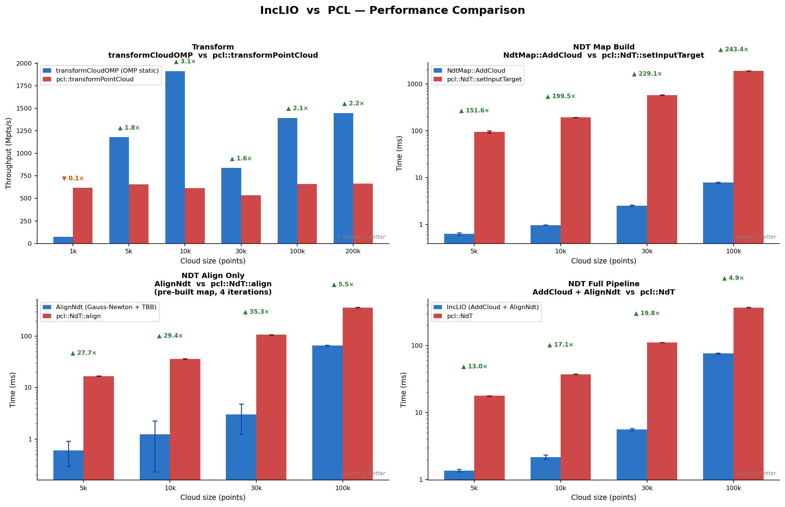

# IncLIO — Incremental LiDAR-Inertial-Wheel Odometry

A real-time **tightly-coupled LiDAR-Inertial-Wheel Odometry** system built on an **Iterated Error-State Kalman Filter (IESKF)** with **Normal Distribution Transform (NDT)** scan-to-map registration. Wheel odometry is fused as a direct IESKF observation (not a loose pose prior) and is optional — the system runs as a pure LiDAR-Inertial (LIO) pipeline when no wheel source is available. Designed for high-rate, low-latency pose estimation on robotic platforms.

<p align="center">
  
</p>

## Features

### Core Odometry
- **IESKF** with iterated NDT observation model for accurate pose correction
- **Continuous-time motion-compensated undistortion** — DLIO constant-jerk / angular-acceleration analytical model (eq. 5, Chen et al. 2023) corrects each point to scan-end time; falls back to slerp/lerp via `use_ct_undistort: false`
- **Tightly-coupled wheel odometry** (optional) — `nav_msgs/Odometry` forward speed + yaw rate fused as IESKF observations (`common/ieskf`) with non-holonomic constraints, lever-arm compensation, and a chi² slip gate; wheel samples are time-synchronized into the same measurement package as the IMU and LiDAR
- **18-DOF error state**: position, velocity, rotation, accelerometer bias, gyroscope bias, gravity

### NDT Map
- **Spatial-hashing voxel map** with O(1) lookup for scan-to-map registration
- **LRU eviction** for bounded memory in real-time operation
- **Incremental map update** — new scans are inserted only when sufficient motion is detected

### Map Storage & Visualization
- **`full_map_`** — accumulated world-frame point cloud, voxel-filtered per scan at insertion time (`map_voxel_size`, default 0.2 m); never published over the wire, only written by the save service
- **Sliding-window local map** — last `local_map_scans` (default 20) world-frame scans kept in a bounded deque; each scan is body-cropped (`body_crop_radius`) and voxel-downsampled before entering the window, then concatenated on a dedicated worker thread for each publish
- Visualization publish cost is constant regardless of total distance travelled — only the sliding window is serialized

### Performance
- **Parallel voxel downsampling** using TBB concurrent hash maps
- **OMP-parallelized** point cloud operations (undistortion, filtering, transform)
- **Zero-cost logging** in Release builds (compile-time spdlog level gating)
- **Offloaded map building** — scan transform, accumulation, and voxel filtering run on a dedicated timer/worker thread, keeping the LiDAR callback latency-free

### ROS2 Wrapper
- **Composable node** (`inclio_ros2::LioNode`) compatible with component containers
- **Multi-threaded executor** (3 threads) with separate callback groups for IMU, LiDAR, and map visualization
- **Optional TF subscription** — the node can listen to `/tf` / `/tf_static` to look up the LiDAR→IMU extrinsic (`use_tf_extrinsic`) and the `base_link`→IMU offset, so odometry, path, and TF are published in the **`base_link` frame**; falls back to the YAML extrinsics if the lookup fails
- **Real-time map visualization** — sliding window of the last N scans published on `~/cloud_world`, voxel-downsampled per scan for bounded publish cost
- **Full map accumulation** — raw world-frame points accumulated in `full_map_`, voxel-filtered at save time; never published over the wire
- **Map save service** (`~/save_map`) — saves the full voxelized map to PCD via `std_srvs/Trigger`
- **Multi-LiDAR support**: Hesai Pandar, Velodyne, Ouster, Livox Mid-360 (native `CustomMsg`)

## Benchmarks

Custom NDT and transform implementations benchmarked against their PCL equivalents on random 3-D point clouds with a 1 m voxel size and 4 Gauss-Newton iterations.

<p align="center">
  
</p>

| Benchmark | IncLIO | PCL | Speedup |
|-----------|--------|-----|---------|
| `transformCloudOMP` (100k pts) | 0.07 ms | 0.15 ms | **~2×** |
| `NdtMap::AddCloud` (100k pts) | 7.85 ms | 1911 ms | **~243×** |
| `AlignNdt` (30k pts, pre-built map) | 3.03 ms | 107 ms | **~35×** |
| Full pipeline (30k pts) | 5.62 ms | 111 ms | **~20×** |

Key observations:
- **Transform**: `transformCloudOMP` has OMP thread-spawn overhead at very small clouds (< 5k pts) and is 1.6–3× faster above that threshold.
- **Map build**: `NdtMap::AddCloud` uses a spatial hash + `std::execution::par_unseq` to update voxel distributions; PCL's `VoxelGridCovariance` is single-threaded and allocates heavily.
- **Alignment**: advantage shrinks at 100k pts because the 700k NEARBY6 residuals (100k × 7 neighbors) saturate the TBB work-stealing scheduler; PCL's kdtree lookup remains cache-friendly at that density.

## Build

```bash
mkdir -p ~/ros2_ws/src
cd ~/ros2_ws/src
git clone --recurse-submodules <repo> inclio_ros2

cd ~/ros2_ws
colcon build --symlink-install
source install/setup.bash
```

Livox support is auto-enabled if `livox_ros_driver2` is found.

## Usage

### Launch
You can download the dataset used in the gif here : https://drive.google.com/drive/folders/1j8PPlxN0IWQibxyUzpR8qZtxrd0K4jAG?usp=drive_link 
```bash
# Hesai Pandar128 / Velodyne / generic PointCloud2
ros2 launch inclio_ros2 inclio_velodyne.launch.py \
    config_file:=$(ros2 pkg prefix inclio_ros2)/share/inclio_ros2/config/velodyne32.yaml \
    imu_topic:=/imu/data \
    lidar_topic:=/velodyne_points

# Livox Mid-360
ros2 launch inclio_ros2 inclio_livox.launch.py \
    config_file:=$(ros2 pkg prefix inclio_ros2)/share/inclio_ros2/config/livox_mid360_ros2.yaml
```

### Save Map

```bash
ros2 service call /inclio_ros2_node/save_map std_srvs/srv/Trigger
# Saves to /tmp/inclio_map.pcd
```

## ROS2 Interface

### Subscriptions

| Topic | Type | Description |
|-------|------|-------------|
| `~/imu` | `sensor_msgs/Imu` | IMU measurements |
| `~/points` | `sensor_msgs/PointCloud2` or `livox_ros_driver2/CustomMsg` | LiDAR point cloud |
| `wheel_odom_topic` | `nav_msgs/Odometry` | Wheel odometry twist (optional — empty topic name disables fusion) |
| `/tf`, `/tf_static` | `tf2_msgs/TFMessage` | **Optional** TF listener — used to look up the LiDAR→IMU extrinsic (`use_tf_extrinsic: true`) and the `base_link`→IMU offset so output is expressed in the `base_link` frame |

### Publications

| Topic | Type | Rate | Description |
|-------|------|------|-------------|
| `~/odometry` | `nav_msgs/Odometry` | Scan rate (~10-20 Hz) | NDT-corrected pose |
| `~/path` | `nav_msgs/Path` | Scan rate | Trajectory history |
| `~/cloud_world` | `sensor_msgs/PointCloud2` | `publish_rate_hz` (default 5 Hz) | Sliding-window local map (last `local_map_scans` scans, voxel-downsampled per scan), in world frame |

### Services

| Service | Type | Description |
|---------|------|-------------|
| `~/save_map` | `std_srvs/Trigger` | Save full map to `/tmp/inclio_map.pcd` |

### TF

- **Broadcast**: `world_frame -> base_frame` (e.g. `odom -> base_link`) at scan rate, enabled via `frames.publish_tf` in the YAML config.
- **Subscription (optional)**: the node runs a TF listener at startup. When `frames.use_tf_extrinsic: true` it reads the `lidar_frame -> imu_frame` extrinsic from the TF tree instead of `mapping.extrinsic_T/R`. Independently, when `base_frame != imu_frame` it also looks up the `base_frame -> imu_frame` offset so odometry, path, and TF are published in the **`base_link` frame** (removes the lever-arm arc on in-place turns). Failed lookups fall back to YAML extrinsics / identity with a warning.

### Parameters

ROS parameters set on the node (sensor decimation, LiDAR type, frames, etc. now live in the YAML config — see [Configuration](#configuration)):

| Parameter | Default | Description |
|-----------|---------|-------------|
| `config_file` | `""` | **Required.** Path to IncLIO YAML config |
| `imu_topic` | `"imu"` | IMU topic name |
| `lidar_topic` | `"points"` | LiDAR topic name |
| `wheel_odom_topic` | `""` | Wheel odometry topic (`nav_msgs/Odometry`); **empty disables wheel fusion** |
| `world_frame` | `"world"` | Fallback TF parent frame (overridden by `frames.world_frame` in YAML) |
| `body_frame` | `"body"` | Fallback TF child frame (overridden by `frames.base_frame` in YAML) |
| `map_voxel_size` | `0.2` | Voxel leaf size applied per scan before accumulation into `full_map_` and the viz window (meters) |
| `body_crop_radius` | `1.0` | Points closer than this to the sensor are removed (robot/vehicle body returns, meters) |
| `publish_rate_hz` | `5.0` | Publish rate of `~/cloud_world` (Hz) |
| `local_map_scans` | `20` | Number of recent scans kept in the sliding window for `~/cloud_world` |
| `publish_path` | `true` | Publish trajectory |
| `publish_cloud` | `true` | Publish point cloud map |

## Configuration

Sensor and pipeline configuration is done via YAML files in `config/` (`velodyne32.yaml`, `hesai128.yaml`, `hesai128_sbg.yaml`, `mid360.yaml`, `osdome128.yaml`, `avia.yaml`). Full annotated example:

```yaml
preprocess:
  lidar_type: 2          # 1 = Livox, 2 = Velodyne, 3 = Ouster, 4 = Hesai
  scan_line: 32          # number of rings
  time_scale: 1e-3       # per-point time field to seconds
  imu_coeff: 1.0         # set to 9.81 if the IMU reports acceleration in g

mapping:                 # used only when frames.use_tf_extrinsic is false
  extrinsic_T: [x, y, z]              # LiDAR -> IMU translation
  extrinsic_R: [r00, r01, ..., r22]   # LiDAR -> IMU rotation (row-major 3x3)

point_filter_num: 1      # decimation factor (keep every N-th point)
max_iteration: 3         # IESKF iterations per scan

# IMU initialization — static init estimates biases/gravity while standing still.
# Set use_static_init: false to start while already moving (uses the priors below;
# prior_gravity is expressed in the body frame).
use_static_init: true
imu_init_time: 5.0       # static initialization duration (seconds)
max_static_gyro_var: 0.5 # gyro variance threshold for static detection
max_static_acce_var: 0.2 # accel variance threshold for static detection
prior_bg: [0.0, 0.0, 0.0]      # gyro bias prior
prior_ba: [0.0, 0.0, 0.0]      # accel bias prior
prior_gravity: [0.0, 0.0, -9.81]

# DLIO continuous-time motion correction (false = original slerp/lerp undistortion)
use_ct_undistort: true

# Wheel-odometry fusion tunables (the topic itself is the ROS param wheel_odom_topic;
# leave the param empty to disable).
wheel_odom:
  r_imu_wheel:   [0.110, -0.180, -0.710]  # IMU -> wheel/axle origin, body frame [m] — measure it!
  vel_noise:     0.10    # forward-speed std-dev [m/s]
  nhc_noise:     0.01    # lateral/vertical non-holonomic-constraint std-dev [m/s]
  yaw_noise:     0.10    # yaw-rate std-dev [rad/s]
  use_lever_arm: true    # include lever-arm coupling into gyro bias
  use_yaw_rate:  true    # include the yaw-rate (gyro-z-bias) row
  chi2_thresh:   13.28   # slip gate: reject obs when chi2 = rᵀS⁻¹r > this (4-DOF, 99%); <= 0 disables

# Frames + optional TF-based extrinsics
frames:
  world_frame:       "odom"        # parent of the published odometry/TF
  base_frame:        "base_link"   # child of the published odometry/TF
  imu_frame:         "imu_link"    # TF lookup target (lidar->imu, base->imu)
  lidar_frame:       "velodyne"    # TF lookup source for the lidar->imu extrinsic
  use_tf_extrinsic:  true          # read lidar->imu from TF instead of mapping.extrinsic_T/R
  tf_lookup_timeout: 5.0           # seconds to wait for static TFs on startup
  publish_tf: true                 # broadcast world_frame -> base_frame
```
## Dependencies

- **Eigen3** — linear algebra
- **Sophus** — SO3/SE3 Lie group operations
- **PCL** — point cloud types, I/O, and `pcl::VoxelGrid` for map downsampling
- **TBB** — parallel voxel downsampling and NDT Gauss-Newton reduction
- **OpenMP** — parallel point cloud operations (undistortion, transform)
- **spdlog** — logging
- **yaml-cpp** — configuration parsing

## Acknowledgements & Citation

IncLIO builds on ideas and code from the following excellent open-source projects.

The continuous-time motion-compensated undistortion is based on [Direct LiDAR-Inertial Odometry (DLIO)](https://github.com/vectr-ucla/direct_lidar_inertial_odometry). If you found this work useful, please cite their manuscript:

```bibtex
@article{chen2022dlio,
  title={Direct LiDAR-Inertial Odometry: Lightweight LIO with Continuous-Time Motion Correction},
  author={Chen, Kenny and Nemiroff, Ryan and Lopez, Brett T},
  journal={2023 IEEE International Conference on Robotics and Automation (ICRA)},
  year={2023},
  pages={3983-3989},
  doi={10.1109/ICRA48891.2023.10160508}
}
```

Many thanks also to [lightning-lm](https://github.com/gaoxiang12/lightning-lm), whose work inspired parts of this system.

<!-- ## Star History

<a href="https://www.star-history.com/?repos=S0UL4%2FIncLIO&type=date&legend=top-left">
 <picture>
   <source media="(prefers-color-scheme: dark)" srcset="https://api.star-history.com/chart?repos=S0UL4/IncLIO&type=date&theme=dark&legend=top-left&sealed_token=7lxRvpCiv1iOY31ARgp_4QJBnz24MlPzDIRJAJZ8318A10Umj-1hbfInkkydH3L8SnhQefFdLVtIDAIY7YKgRngcqJ7spKvlvdwyYywh7BYkdKLQGQvdcx0HekZ-wSOI0__7vi8COh2tPhX40R0Orsfgc0GyGu8DJWfHIp7L-Om5q7WJ_GBDuuRbNqPr" />
   <source media="(prefers-color-scheme: light)" srcset="https://api.star-history.com/chart?repos=S0UL4/IncLIO&type=date&legend=top-left&sealed_token=7lxRvpCiv1iOY31ARgp_4QJBnz24MlPzDIRJAJZ8318A10Umj-1hbfInkkydH3L8SnhQefFdLVtIDAIY7YKgRngcqJ7spKvlvdwyYywh7BYkdKLQGQvdcx0HekZ-wSOI0__7vi8COh2tPhX40R0Orsfgc0GyGu8DJWfHIp7L-Om5q7WJ_GBDuuRbNqPr" />
   
 </picture>
</a> -->
